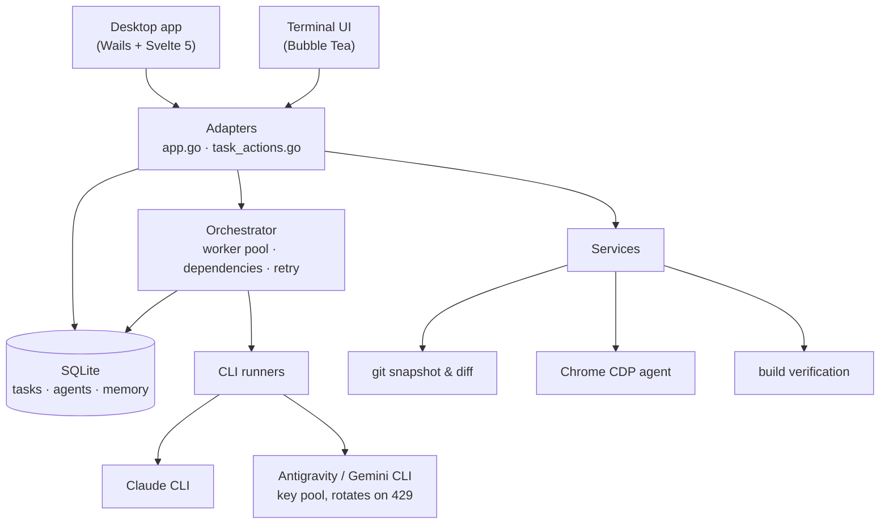

<div align="center">

# Claude Suite

**An AI agent orchestrator with a desktop app and a terminal UI.**

Describe what you want built. It decomposes the work into tasks, dispatches them
to Claude and Gemini CLI sub-agents running in parallel against your project
folder, then verifies the result actually builds and the page actually works.

[](https://github.com/thydynh03/claude_suite/actions/workflows/ci.yml)
[](LICENSE)

[Quick start](#quick-start) · [How it works](#how-it-works) · [Terminal UI](#terminal-ui) · [Contributing](CONTRIBUTING.md)

</div>

---

## What it does

You give it a goal. It plans, executes, checks its own work, and fixes what it
broke:

1. **Plans.** An AI decomposes your requirement into tasks tagged by role — BA,
   architecture, code, QA, DevOps — with dependencies between them.
2. **Dispatches.** A worker pool runs several sub-agents at once, respecting
   those dependencies. Each task can be stopped or retried on its own.
3. **Verifies.** When a task finishes, the workspace must still build
   (`go build`, `npm run build`) before the task is marked done.
4. **Tests in a real browser.** Tasks tagged `[E2E]` drive Chrome, assert the
   text you listed with `[EXPECT: ...]`, and capture console errors.
5. **Fixes itself.** A failing browser test spawns a repair task seeded with the
   exact console errors and failed assertions, then re-runs the test. Bounded by
   a retry limit.

Everything the agent does is visible while it happens: streamed output, the
tools it calls, the git diff it produced, and the screenshot it captured.

---

## Features

**Orchestration**
- Parallel sub-agents (1–6) with dependency-aware dispatch
- Per-task stop and retry; approval gates for architecture and BA roles
- Automatic fallback to another provider when a quota is exhausted
- Real token usage and cost, parsed from the Claude CLI's `stream-json` output

**Working on your code**
- Sub-agents create and edit files directly in the workspace you choose
- A git snapshot is taken before each task, so the task's changes stay reviewable
  as an uncommitted diff
- Source Control panel: stage, commit, branch, revert, and a safe git command box
- "AI wrote this commit" — a Conventional Commits message generated from the diff

**Browser agent**
- Chrome DevTools Protocol, driven natively from Go
- Assertion-based E2E runs with console-error capture and screenshots
- A multi-step ReAct loop with its own persistent Chrome profile, so sites stay
  signed in between runs (desktop app only)

**Providers**
- Claude CLI and Antigravity/Gemini CLI
- Multi-account key pool with automatic rotation on HTTP 429
- Google OAuth sign-in handled by a local callback listener on `:8045`

**Two frontends, one backend**
- Wails desktop app (Svelte 5) with Kanban board, task inspector, command
  palette (`Ctrl+K`), and a 3D office view
- Keyboard-native terminal UI (Bubble Tea), read-only unless you pass `--write`

---

## Quick start

### Prerequisites

- **Go** — the version pinned in `go.mod`
- **Node.js** 20.x
- **Wails CLI** v2.13.0 — `go install github.com/wailsapp/wails/v2/cmd/wails@v2.13.0`
- At least one agent CLI on `PATH`: `claude`, or `agy` / `antigravity`

SQLite is a pure-Go driver, so no C toolchain is needed.

### Run it

```bash
git clone https://github.com/thydynh03/claude_suite.git
cd claude_suite

wails dev          # desktop app with hot reload
```

### Build a release binary

```bash
wails build -platform windows/amd64 -clean
# -> build/bin/ClaudeSuite.exe
```

Windows is the shipping platform: the CLI runners use Windows-specific process
flags to keep sub-agent consoles hidden.

### Configuration

| What | Where |
|---|---|
| Google OAuth client | `CLAUDE_SUITE_GCP_CLIENT_ID` / `CLAUDE_SUITE_GCP_CLIENT_SECRET`, or `gcp_oauth.json` in the data directory |
| Database, config, logs | the app data directory (`%LOCALAPPDATA%\ClaudeSuite` on Windows) |
| Outbound notifications | Settings → Integrations: a webhook URL that receives task-completed and task-failed events |

Credentials are never read from the repository, and the files above are
gitignored.

---

## How it works



Both frontends are thin adapters over the same services. A capability must use
the **same method name on both**, and `backend/contract` fails the build when it
does not — see [CONTRIBUTING.md](CONTRIBUTING.md).

---

## Terminal UI

The TUI is a keyboard-native frontend over the same database and services. It
opens **read-only by default**: no migrations, no writes.

```bash
# Inspect an existing database safely
go run ./cmd/claude-suite-tui --db /path/to/agent_manager.db

# Enable task mutations and orchestration
go run ./cmd/claude-suite-tui --db /path/to/agent_manager.db --write

# Validate a database without starting the UI
go run ./cmd/claude-suite-tui --db /path/to/agent_manager.db --check
```

| Key | Action |
|---|---|
| `Tab` / `Shift+Tab` | move between pages |
| `Enter` | enter the page content |
| `Esc` | back to navigation |
| `:` | command centre |
| `?` | contextual key bindings |
| `Ctrl+Enter` | submit in Cockpit (`Enter` inserts a newline) |

The TUI covers the board, agents, pipeline, git and a simple browser run. The
autonomous multi-step browser agent is desktop-only, by design — the TUI stays a
lightweight inspector.

---

## Versioning

The version shown in the app is resolved in order: a persisted `version.json` in
the data directory, then `git describe --tags`, then a value injected at build
time with `-ldflags "-X claude_suite/backend/version.BuildVersion=..."`, then a
compiled-in fallback.

---

## Documentation

| Document | For |
|---|---|
| [CONTRIBUTING.md](CONTRIBUTING.md) | setting up, what CI checks, the non-obvious rules |
| [docs/ARCHITECTURE_DECISIONS.md](docs/ARCHITECTURE_DECISIONS.md) | decisions that look redundant but are load-bearing |
| [CLAUDE.md](CLAUDE.md) | orientation for AI coding agents working in this repo |

---

## License

MIT — see [LICENSE](LICENSE).
