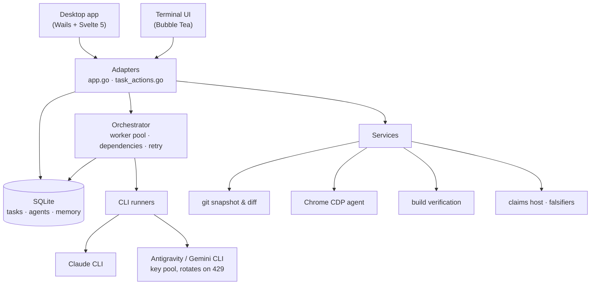

<div align="center">


# Claude Suite

**Describe what you want built. Watch a team of AI agents build it, check their own
work, and fix what they broke.**

A Windows desktop app and a terminal UI that turn one sentence into a Kanban board
of tasks, dispatch those tasks to Claude and Gemini CLI sub-agents running in
parallel against your project folder, and refuse to mark anything "done" until the
workspace still builds.

[](https://github.com/thydynh03/claude_suite/actions/workflows/ci.yml)
[](https://github.com/thydynh03/claude_suite/actions/workflows/codeql.yml)
[](https://github.com/thydynh03/claude_suite/releases/latest)
[](https://github.com/thydynh03/claude_suite/releases)
[](LICENSE)
[](go.mod)
[](frontend/package.json)

**English** · [Tiếng Việt](README.vi.md)

[Install](#install) · [First run](#first-run) · [How it works](#how-it-works) · [Adjudication](#adjudication-proving-a-finding-instead-of-asserting-it) · [Terminal UI](#terminal-ui) · [Troubleshooting](#troubleshooting) · [Contributing](CONTRIBUTING.md)

</div>

<!--
  Screenshots go here. Drop them in docs/assets/ and reference them as:
  
  A board mid-run and the Task Inspector drawer are the two that sell it.
-->

---

## Why this exists

Most AI coding tools give you a chat box and a diff. That is fine for one file. It
falls apart the moment the work is "build me the thing", because nobody is holding
the plan, nobody notices that step 4 broke step 2, and nothing tells you whether
the result actually runs.

Claude Suite keeps the plan, the dependencies, the verification and the evidence in
one place:

- **It plans.** An AI decomposes your requirement into tasks tagged by role — BA,
  architecture, code, QA, DevOps — with dependencies between them.
- **It dispatches.** A worker pool runs several sub-agents at once and respects
  those dependencies. Any task can be stopped or retried on its own.
- **It verifies.** A task is not done until the workspace still builds
  (`go build`, `npm run build`). A build that broke is the task's problem, not yours.
- **It tests in a real browser.** Tasks tagged `[E2E]` drive Chrome over the
  DevTools Protocol, assert the text you listed with `[EXPECT: ...]`, and capture
  console errors and a screenshot.
- **It fixes itself.** A failing browser test spawns a repair task seeded with the
  exact console errors and failed assertions, then re-runs the test — bounded by a
  retry limit, so it cannot loop forever.

Everything is visible while it happens: streamed agent output, the tools each agent
called, the git diff it produced, real token usage and real cost.

---

## Install

### Windows — the installer (recommended)

1. Download `ClaudeSuite-amd64-installer.exe` from the
   [latest release](https://github.com/thydynh03/claude_suite/releases/latest).
2. Run it. The app appears in the Start menu and uninstalls through
   **Apps & features** like any other program.
3. The installer also places two command-line companions next to the app:
   `claude-suite-claim` (used by teammates' agents to file findings) and
   `claude-suite-tui` (the terminal UI). No Go toolchain needed.

The installer carries the Microsoft WebView2 bootstrapper, so the app works on a
clean Windows install.

> **Portable option.** `ClaudeSuite.exe` in the same release runs without
> installing — good for a USB stick. It creates no shortcuts and does not
> self-update.

### You also need at least one agent CLI

Claude Suite orchestrates agent CLIs; it does not replace them. Install **at least
one** and make sure it is on your `PATH`:

| Provider | CLI | Notes |
|---|---|---|
| Anthropic | [`claude`](https://claude.com/claude-code) | Token usage and cost are parsed from its `stream-json` output, so numbers are real, not estimated |
| Google | `agy` / `antigravity` (Gemini) | Supports a multi-account key pool that rotates automatically on HTTP 429 |

If you install a CLI *after* starting the app, you do not have to restart: the
runners re-resolve the executable on the next task.

### Platform support

| Platform | Desktop app | Terminal UI | Status |
|---|---|---|---|
| Windows 10/11 x64 | ✅ | ✅ | Shipping platform, tested every release |
| Linux | — | ✅ | Backend and TUI build and are tested in CI; the desktop app is not built for it |
| macOS | — | ✅ | Should build from source; not covered by CI |

The desktop app is Windows-first on purpose: the CLI runners use Windows-specific
process flags to keep sub-agent consoles hidden, and the release pipeline is built
around NSIS. See [ARCHITECTURE_DECISIONS.md](docs/ARCHITECTURE_DECISIONS.md) §3.

---

## First run

1. **Pick a workspace.** Choose the project folder the agents will work in. This is
   the single most important setting — sub-agents create and edit files there
   directly, and nothing outside that folder is touched.
2. **Connect a provider.** Sign in with Google for the Gemini pool, or rely on the
   `claude` CLI's own session. Multiple accounts can be pooled so a rate limit on
   one does not stop the run.
3. **Describe the goal.** On the **Task Board**, use the AI Plan Builder: one
   paragraph of what you want. It comes back as a board of tasks with roles and
   dependencies, which you can edit before anything runs.
4. **Run it.** Set how many agents may work at once (1–6) and start. Watch the
   board move; open any card for the Task Inspector — streamed output, tool calls,
   the diff, the screenshot.
5. **Review the diff.** A git snapshot is taken before every task, so each task's
   own changes stay reviewable as an uncommitted diff. The Source Control panel
   stages, commits, branches and reverts, and can write a Conventional Commits
   message from the diff.

The interface ships in **Vietnamese and English** — switch with the VI/EN control
in the top bar.

---

## Features

**Orchestration**
- Parallel sub-agents (1–6) with dependency-aware dispatch
- Per-task stop and retry; approval gates for architecture and BA roles
- Automatic fallback to another provider when a quota is exhausted
- Real token usage and cost, parsed from the Claude CLI's `stream-json` output
- Scheduler for recurring runs, plus outbound webhooks on task completed/failed

**Working on your code**
- Sub-agents create and edit files directly in the workspace you choose
- A git snapshot before each task keeps that task's changes as a clean diff
- Source Control panel: stage, commit, branch, revert, and a guarded git command box
- Code Studio: an editor with a side-by-side merge view and an ask/edit agent loop

**Browser agent**
- Chrome DevTools Protocol, driven natively from Go — no Node, no Puppeteer
- Assertion-based E2E runs with console-error capture and screenshots
- A multi-step ReAct loop with its own persistent Chrome profile, so sites stay
  signed in between runs (desktop app only)

**Providers**
- Claude CLI and Antigravity/Gemini CLI
- Multi-account key pool with automatic rotation on HTTP 429
- Real plan (Free/Pro/Ultra) and per-model remaining quota, read from Google's
  Code Assist endpoints — and left blank with a stated reason when they cannot be
  read, rather than filled with a number nobody measured
- Google OAuth sign-in through a local callback listener on `127.0.0.1:8045`

**Two frontends, one backend**
- Wails desktop app (Svelte 5): Kanban board, task inspector, command palette
  (`Ctrl+K`), 3D office view
- Interface zoom with `Ctrl` + mouse wheel, or `Ctrl` `+` / `Ctrl` `-`;
  `Ctrl` `Shift` `0` returns to 100%. The level is remembered between launches.
  (`Ctrl` `0`–`9` are the navigation tabs, which is why reset takes `Shift`.)
- Keyboard-native terminal UI (Bubble Tea), read-only unless you pass `--write`

---

## Adjudication: proving a finding instead of asserting it

When several agents review the same code, they produce confident prose. Some of it
is wrong. Claude Suite has a **claims** system that makes the difference checkable.

An agent files a claim with a **falsifier** — the name of a check in
`.claude-suite/checks.json` that **passes when the claim is wrong**. So a *failing*
check confirms the defect:

```bash
claude-suite-claim --host ws://HOST:9111 --session ID --token T \
  --author you/your-agent --provider claude \
  --subject "backend/cli/process_windows.go:17" \
  --assert  "cmd.Wait() never returns when the console is visible" \
  --falsify "console-window-hidden"
```

Omit `--falsify` and the claim is recorded as an **opinion**: kept and shown, but it
cannot block a merge. That is deliberate — a finding nobody can check is a
suggestion, and being asked for the command that would disprove it is what separates
a real defect from a confident guess.

The collect phase is blind (agents cannot see each other's claims), adjudication runs
the falsifiers, and the result lands in `.claude-suite/session-<id>/verdict.json`.
Sessions also carry free-form chat between the agents and a human arbiter — but talk
is not evidence, and only a falsifier settles a claim.

Agents can join over the CLI above or over **MCP**, with nothing downloaded:

```bash
claude mcp add --transport http claude-suite-debate "http://HOST:9111/mcp/SESSION?token=T"
```

---

## How it works



Both frontends are thin adapters over the same services. A capability must use the
**same method name on both**, and `backend/contract` fails the build when it does
not — see [CONTRIBUTING.md](CONTRIBUTING.md).

---

## Terminal UI

A keyboard-native frontend over the same database and services. It opens
**read-only by default**: no migrations, no writes.

```bash
# Inspect an existing database safely
claude-suite-tui --db /path/to/agent_manager.db

# Enable task mutations and orchestration
claude-suite-tui --db /path/to/agent_manager.db --write

# Validate a database without starting the UI
claude-suite-tui --db /path/to/agent_manager.db --check
```

| Key | Action |
|---|---|
| `Tab` / `Shift+Tab` | move between pages |
| `Enter` | enter the page content |
| `Esc` | back to navigation |
| `:` | command centre |
| `?` | contextual key bindings |
| `Ctrl+Enter` | submit in Cockpit (`Enter` inserts a newline) |

The TUI covers the board, agents, pipeline, git and a simple browser run. The
autonomous multi-step browser agent is desktop-only by design — the TUI stays a
lightweight inspector.

---

## Configuration

| What | Where |
|---|---|
| Data directory (database, config, logs, Chrome profile) | `%LOCALAPPDATA%\ClaudeSuite` on Windows, `~/.claude_suite` elsewhere |
| Move the data directory | `CLAUDE_SUITE_DATA_DIR=/some/path` |
| Google OAuth client | `CLAUDE_SUITE_GCP_CLIENT_ID` / `CLAUDE_SUITE_GCP_CLIENT_SECRET`, or `gcp_oauth.json` in the data directory |
| Outbound notifications | Settings → Integrations: a webhook URL receiving task-completed and task-failed events |
| Agent role prompts | editable markdown per role, in the data directory |

Credentials are never read from the repository. On Windows, saved OAuth refresh
tokens are sealed with DPAPI to the current user, so copying the file to another
machine will not hand over your accounts.

---

## Build from source

```bash
git clone https://github.com/thydynh03/claude_suite.git
cd claude_suite

wails dev                                     # desktop app, hot reload
wails build -platform windows/amd64 -clean    # -> build/bin/ClaudeSuite.exe
```

Prerequisites: Go (version pinned in `go.mod`), Node.js 20.x, and Wails CLI v2.13.0
(`go install github.com/wailsapp/wails/v2/cmd/wails@v2.13.0`). SQLite is
`modernc.org/sqlite`, a pure-Go driver, so **no C toolchain is required**.

Full setup, the rules that are not obvious from the code, and what CI checks are in
[CONTRIBUTING.md](CONTRIBUTING.md).

---

## Troubleshooting

<details>
<summary><b>"Claude Code CLI not found" / "Antigravity CLI not found"</b></summary>

The CLI is not on the `PATH` the app inherited. Install it, then just run the task
again — the runners re-resolve the executable per task, so a running app does pick
up a `PATH` an installer just extended. On Windows only `.exe`, `.cmd`, `.bat` and
`.com` are runnable; a `.ps1` shim will not work.
</details>

<details>
<summary><b>Everything rate-limits with HTTP 429</b></summary>

Add more accounts to the key pool (OAuth Pool page). The pool rotates on 429 and
disables an account whose refresh token was revoked, rather than retrying it every
minute. If only one provider is configured, quota exhaustion stops the run — connect
the other one so fallback has somewhere to go.
</details>

<details>
<summary><b>The app opens blank, or startup messages never appear</b></summary>

That is the WebView2 runtime failing to start. Install the Microsoft Edge WebView2
Evergreen runtime and reopen. Startup messages are also written to the log file in
the data directory, so nothing is lost even when the window never renders.
</details>

<details>
<summary><b>"Could not decrypt anti_accounts.json"</b></summary>

The file was sealed to a different Windows user or a different machine. The app
moves it aside as `anti_accounts.json.unreadable-<timestamp>` and starts a fresh
one, so nothing is destroyed — sign in again, and delete the old file once you are
sure you do not need it.
</details>

<details>
<summary><b>Sub-agents edited files I did not expect</b></summary>

Sub-agents run with `--dangerously-skip-permissions` inside the workspace folder.
That is what lets them work, and it is why the workspace should be a git repository
you have committed. The pre-task snapshot means every task's changes are recoverable
as a diff. Read [SECURITY.md](SECURITY.md) before pointing it at anything you cannot
afford to lose.
</details>

---

## Versioning

The version shown in the app resolves in order: a persisted `version.json` in the
data directory, then `git describe --tags`, then a value injected at build time with
`-ldflags "-X claude_suite/backend/version.BuildVersion=..."`, then a compiled-in
fallback. Releases are built from a `v*` tag, and the tag is the single source of
truth for what the binary reports.

---

## Documentation

| Document | For |
|---|---|
| [CONTRIBUTING.md](CONTRIBUTING.md) · [🇻🇳](CONTRIBUTING.vi.md) | setting up, what CI checks, the rules that are not obvious |
| [docs/ARCHITECTURE_DECISIONS.md](docs/ARCHITECTURE_DECISIONS.md) | 13 decisions that look redundant but are load-bearing |
| [SECURITY.md](SECURITY.md) | the threat model, and how to report a vulnerability |
| [CODE_OF_CONDUCT.md](CODE_OF_CONDUCT.md) | how we treat each other |
| [CLAUDE.md](CLAUDE.md) | orientation for AI coding agents working in this repo |
| [docs/](docs/README.md) | the full index, including internal plans |

---

## Contributing

Issues and pull requests are welcome — bug reports especially. Start with
[CONTRIBUTING.md](CONTRIBUTING.md); it explains the two-frontend contract and the
handful of rules that have already cost someone a debugging session.

## License

MIT — see [LICENSE](LICENSE).

<div align="center">

If this saved you an afternoon, a ⭐ helps other people find it.

</div>
