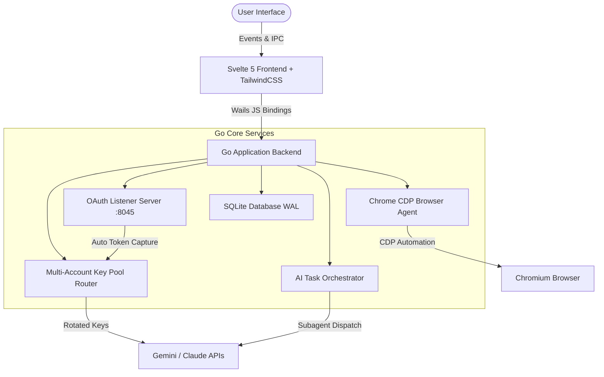

<div align="center">

# 🚀 Claude Suite (Antigravity Manager)

### *Next-Generation Enterprise AI Agent Orchestrator, Photorealistic 3D Virtual Office & Multi-Account OAuth Pool*

[](https://golang.org)
[](https://wails.io)
[](https://svelte.dev)
[](https://www.typescriptlang.org)
[](https://tailwindcss.com)
[](https://threejs.org)
[](LICENSE)

<br/>

[✨ Features](#-highlights--features) • [💻 Tech Stack](#-tech-stack) • [⚙️ Quick Start](#%EF%B8%8F-quick-start) • [🏛 Architecture](#-architecture) • [📜 License](#-license)

</div>

---

## ✨ Highlights & Features

- 🔑 **Multi-Account OAuth Key Pool (Antigravity Manager)** — Automated Google OAuth 2.0 token rotation with rate limit 429 protection, custom GCP Client ID support, and a 100% automated local callback listener server (`:8045`). Zero copy-pasting required!
- 🏢 **Photorealistic PBR 3D Virtual Office Engine** — Expanded 35-seat floorplan featuring dual curved monitors, mechanical RGB keyboards, ergonomic gaming chairs, Burgundy velvet & Carrara marble PBR materials, corporate role assignments, and a 4-phase simulated corporate workflow.
- 🌐 **Native Chrome CDP Browser Agent** — Built-in Chrome DevTools Protocol E2E browser automation agent written natively in Go. Supports automated web testing, DOM element inspection, screenshot galleries, and HTTP network logging.
- ⚡️ **High-Performance Go Core Backend** — Ultra-fast Go application engine utilizing SQLite WAL journaling, automated task decomposition pipelines, cron-based automated scheduling, and real-time WebSocket IPC event streaming.
- 🌐 **Internationalization (i18n)** — Runtime bilingual switching between **Tiếng Việt (🇻🇳 VI)** and **English (🇺🇸 EN)** for the primary sidebar navigation, with more UI surfaces being translated over time.
- 📊 **Real-time System Telemetry & Cost Analytics** — Live monitoring of RAM allocation (MB), CPU usage, active Goroutines, active API keys, and an estimated AI token cost estimator.
- 🛠 **Integrated Code Studio & Prompt Architect** — Pre-built prompt engineering template library (Refactor, Security Audit, Performance Boost, Unit Tests) and multi-language code studio.

---

## 💻 Tech Stack

| Layer | Technologies & Libraries |
|---|---|
| **Core Desktop Engine** | Go 1.22, Wails v2 (Native WebView2 Engine) |
| **Frontend Framework** | Svelte 5, TypeScript 5, Vite 6 |
| **UI Design System** | Tailwind CSS 3, Material Design 3 (M3) Tokens |
| **3D Graphics & WebGL** | Three.js, OrbitControls, PBR Materials, Directional Lighting |
| **Database & Persistence** | SQLite3, WAL Journaling, Dynamic Schema Migration Engine |
| **Browser Automation** | Chrome DevTools Protocol (CDP Native Go Service) |
| **Internationalization** | Svelte Derived Store i18n (`vi` / `en`) |
| **CI/CD & Releases** | GitHub Actions Automated Cross-Platform Release Pipeline |

---

## ⚙️ Quick Start

### Prerequisites
- **Go**: `1.22` or higher
- **Node.js**: `20.x` or higher
- **Wails CLI**: `v2.13.0` (`go install github.com/wailsapp/wails/v2/cmd/wails@latest`)

### 1. Clone the Repository
```bash
git clone https://github.com/thydynh03/claude_suite.git
cd claude_suite
```

### 2. Live Development Mode
Run the application in hot-reloading development mode:
```bash
wails dev
```
- Frontend Dev Server runs at: `http://localhost:5173`
- Backend IPC Dev Server runs at: `http://localhost:34115`

### 3. Build Production Executable
Compile a standalone redistributable binary package:
```bash
wails build -platform windows/amd64 -clean
```
The compiled executable will be located in `build/bin/ClaudeSuite.exe`.

---

## 🏛 Architecture



---

## 📊 4-Layer Dynamic Versioning

Claude Suite features zero-hardcode dynamic versioning:
1. **Local Persisted Version**: Reads `%APPDATA%/ClaudeSuite/version.json` updated upon auto-update.
2. **Git Describe Tag**: Queries `git describe --tags --abbrev=0` dynamically during development.
3. **Linker Flag Injection**: Injected at compile time via `wails build -ldflags "-X claude_suite/backend/version.BuildVersion=v..."`.
4. **Fallback Release**: Default build release version.

---

## 📜 License & Contribution

Distributed under the **MIT License**. See `LICENSE` for more information.

Developed with ❤️ by **thydynh03**. Contributions and pull requests are welcome!
