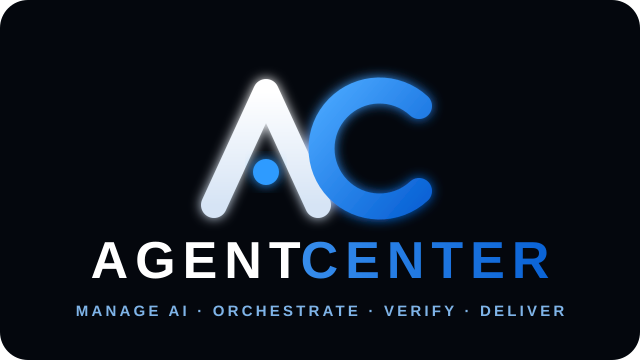
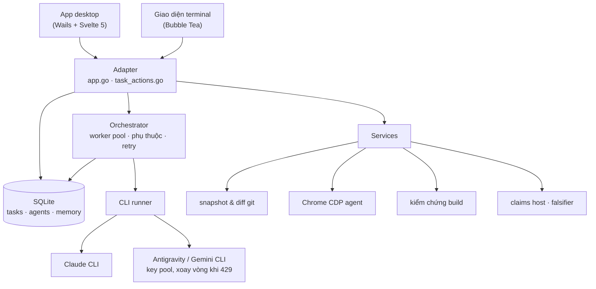

<div align="center">



# Agent Center

**Mô tả thứ bạn muốn xây. Xem một đội agent AI xây nó, tự kiểm tra việc mình làm,
và sửa lại những gì chúng làm hỏng.**

Ứng dụng desktop cho Windows kèm một giao diện terminal, biến một câu mô tả thành
bảng Kanban các task, giao task cho các sub-agent Claude và Gemini CLI chạy song
song trong thư mục dự án của bạn, và không chịu đánh dấu "xong" chừng nào workspace
còn chưa build được.

[](https://github.com/thydynh03/Agent_Center/actions/workflows/ci.yml)
[](https://github.com/thydynh03/Agent_Center/actions/workflows/codeql.yml)
[](https://github.com/thydynh03/Agent_Center/releases/latest)
[](https://github.com/thydynh03/Agent_Center/releases)
[](LICENSE)
[](go.mod)
[](frontend/package.json)

[English](README.md) · **Tiếng Việt**

[Cài đặt](#cài-đặt) · [Chạy lần đầu](#chạy-lần-đầu) · [Cách hoạt động](#cách-hoạt-động) · [Phân xử](#phân-xử-chứng-minh-một-lỗi-thay-vì-khẳng-định-nó) · [Giao diện terminal](#giao-diện-terminal) · [Xử lý sự cố](#xử-lý-sự-cố) · [Đóng góp](CONTRIBUTING.vi.md)

</div>

<!--
  Ảnh chụp màn hình đặt ở đây. Bỏ file vào docs/assets/ rồi tham chiếu:
  
  Hai ảnh đáng giá nhất: bảng Kanban lúc đang chạy, và drawer Task Inspector.
-->

---

## Vì sao có dự án này

Phần lớn công cụ code bằng AI cho bạn một ô chat và một cái diff. Điều đó ổn với một
file. Nó sụp đổ ngay khi công việc là "làm cho tôi cả cái này", vì không ai giữ kế
hoạch, không ai nhận ra bước 4 vừa làm hỏng bước 2, và không gì nói cho bạn biết kết
quả có chạy được thật hay không.

Agent Center giữ kế hoạch, các phụ thuộc, phần kiểm chứng và bằng chứng ở cùng một
chỗ:

- **Lập kế hoạch.** Một AI phân rã yêu cầu của bạn thành các task gắn vai trò — BA,
  kiến trúc, code, QA, DevOps — kèm phụ thuộc giữa chúng.
- **Điều phối.** Một worker pool chạy nhiều sub-agent cùng lúc và tôn trọng các phụ
  thuộc đó. Mỗi task đều dừng hoặc chạy lại được riêng.
- **Kiểm chứng.** Một task chưa xong chừng nào workspace còn chưa build được
  (`go build`, `npm run build`). Build vỡ là việc của task đó, không phải của bạn.
- **Test trên trình duyệt thật.** Task gắn nhãn `[E2E]` điều khiển Chrome qua
  DevTools Protocol, kiểm tra đúng những chuỗi bạn liệt kê bằng `[EXPECT: ...]`, và
  thu lại lỗi console cùng ảnh chụp màn hình.
- **Tự sửa.** Một bài test trình duyệt thất bại sẽ sinh ra task sửa lỗi, được nạp sẵn
  đúng các lỗi console và các assertion đã trượt, rồi chạy lại bài test — có giới hạn
  số lần thử, nên nó không thể lặp vô tận.

Mọi thứ đều nhìn thấy được ngay lúc đang diễn ra: output của agent chảy theo thời
gian thực, các tool mà từng agent gọi, diff git nó tạo ra, số token và chi phí thật.

---

## Cài đặt

### Windows — dùng bộ cài (khuyến nghị)

1. Tải `AgentCenter-amd64-installer.exe` từ
   [bản phát hành mới nhất](https://github.com/thydynh03/Agent_Center/releases/latest).
2. Chạy nó. App xuất hiện trong Start menu và gỡ được qua **Apps & features** như mọi
   ứng dụng bình thường.
3. Bộ cài đặt kèm luôn hai công cụ dòng lệnh nằm cạnh app: `agent-center-claim`
   (agent của đồng đội dùng để nộp claim) và `agent-center-tui` (giao diện terminal).
   Không cần cài Go.

Bộ cài mang theo trình khởi tạo Microsoft WebView2, nên app chạy được trên một máy
Windows vừa cài mới.

> **Bản chạy thẳng.** `AgentCenter.exe` trong cùng bản phát hành chạy không cần cài —
> hợp để mang theo USB. Nó không tạo shortcut và không tự cập nhật.

### Bạn cũng cần ít nhất một agent CLI

Agent Center điều phối các agent CLI chứ không thay thế chúng. Hãy cài **ít nhất
một** và đảm bảo nó nằm trong `PATH`:

| Nhà cung cấp | CLI | Ghi chú |
|---|---|---|
| Anthropic | [`claude`](https://claude.com/claude-code) | Số token và chi phí được đọc từ output `stream-json` của nó, nên là số thật chứ không phải ước lượng |
| Google | `agy` / `antigravity` (Gemini) | Hỗ trợ pool nhiều tài khoản, tự xoay vòng khi gặp HTTP 429 |

Nếu bạn cài CLI *sau khi* app đã mở, không cần khởi động lại: các runner tự dò lại
đường dẫn ở task kế tiếp.

### Nền tảng được hỗ trợ

| Nền tảng | App desktop | Giao diện terminal | Tình trạng |
|---|---|---|---|
| Windows 10/11 x64 | ✅ | ✅ | Nền tảng phát hành chính, kiểm thử mỗi bản release |
| Linux | — | ✅ | Backend và TUI build được và có test trong CI; app desktop không build cho nền này |
| macOS | — | ✅ | Về lý thuyết build được từ nguồn; CI không phủ |

App desktop ưu tiên Windows là có chủ ý: các CLI runner dùng cờ tiến trình riêng của
Windows để giấu cửa sổ console của sub-agent, và quy trình phát hành xây quanh NSIS.
Xem [ARCHITECTURE_DECISIONS.md](docs/ARCHITECTURE_DECISIONS.md) mục 3.

---

## Chạy lần đầu

1. **Chọn workspace.** Chọn thư mục dự án mà các agent sẽ làm việc trong đó. Đây là
   thiết lập quan trọng nhất — sub-agent tạo và sửa file trực tiếp ở đó, và không
   đụng vào bất cứ thứ gì ngoài thư mục ấy.
2. **Kết nối nhà cung cấp.** Đăng nhập Google cho pool Gemini, hoặc dựa vào phiên
   đăng nhập sẵn có của CLI `claude`. Có thể gộp nhiều tài khoản để một tài khoản bị
   giới hạn không làm dừng cả lượt chạy.
3. **Mô tả mục tiêu.** Ở trang **Task Board**, dùng AI Plan Builder: một đoạn văn mô
   tả thứ bạn muốn. Nó trả về một bảng task kèm vai trò và phụ thuộc, bạn sửa lại
   được trước khi bất cứ thứ gì chạy.
4. **Chạy.** Đặt số agent được làm cùng lúc (1–6) rồi bắt đầu. Xem bảng dịch chuyển;
   mở một thẻ bất kỳ để vào Task Inspector — output theo thời gian thực, các tool đã
   gọi, diff, ảnh chụp màn hình.
5. **Xem lại diff.** Trước mỗi task app đều chụp một snapshot git, nên thay đổi của
   riêng task đó luôn nằm lại dưới dạng diff chưa commit. Panel Source Control cho
   phép stage, commit, tạo nhánh, hoàn tác, và viết được message theo chuẩn
   Conventional Commits từ chính diff.

Giao diện có sẵn **tiếng Việt và tiếng Anh** — đổi bằng nút VI/EN trên thanh trên
cùng.

---

## Tính năng

**Điều phối**
- Sub-agent chạy song song (1–6), điều phối theo phụ thuộc
- Dừng và chạy lại theo từng task; cổng phê duyệt cho vai trò kiến trúc và BA
- Tự chuyển sang nhà cung cấp khác khi hết quota
- Số token và chi phí thật, đọc từ output `stream-json` của Claude CLI
- Bộ lập lịch cho các lượt chạy định kỳ, kèm webhook gửi ra khi task xong/lỗi

**Làm việc trên code của bạn**
- Sub-agent tạo và sửa file trực tiếp trong workspace bạn chọn
- Snapshot git trước mỗi task giữ thay đổi của task đó thành một diff sạch
- Panel Source Control: stage, commit, nhánh, hoàn tác, và ô lệnh git có kiểm soát
- Code Studio: trình soạn thảo với khung so sánh song song và vòng lặp agent hỏi/sửa

**Browser agent**
- Chrome DevTools Protocol, điều khiển thẳng từ Go — không cần Node, không Puppeteer
- Chạy E2E theo assertion, thu lỗi console và ảnh chụp màn hình
- Vòng lặp ReAct nhiều bước với profile Chrome riêng, nên các site giữ nguyên trạng
  thái đăng nhập giữa các lần chạy (chỉ có ở app desktop)

**Nhà cung cấp**
- Claude CLI và Antigravity/Gemini CLI
- Pool nhiều tài khoản, tự xoay vòng khi gặp HTTP 429
- Gói thật (Free/Pro/Ultra) và hạn mức còn lại của từng model, đọc từ endpoint
  Code Assist của Google — và để trống kèm lý do khi không đọc được, thay vì điền
  một con số không ai đo
- Đăng nhập Google OAuth qua listener callback cục bộ ở `127.0.0.1:8045`

**Hai giao diện, một backend**
- App desktop Wails (Svelte 5): bảng Kanban, task inspector, command palette
  (`Ctrl+K`), văn phòng 3D
- Phóng to/thu nhỏ giao diện bằng `Ctrl` + lăn chuột, hoặc `Ctrl` `+` / `Ctrl` `-`;
  `Ctrl` `Shift` `0` về lại 100%. Mức zoom được nhớ giữa các lần mở app.
  (`Ctrl` `0`–`9` là phím chuyển tab, nên phím reset mới phải kèm `Shift`.)
- Giao diện terminal thuần bàn phím (Bubble Tea), chỉ đọc trừ khi truyền `--write`

---

## Phân xử: chứng minh một lỗi thay vì khẳng định nó

Khi nhiều agent cùng review một đoạn code, chúng sinh ra những đoạn văn rất tự tin.
Một phần trong đó sai. Agent Center có hệ thống **claims** để biến sự khác biệt đó
thành thứ kiểm chứng được.

Một agent nộp claim kèm **falsifier** — tên của một check trong
`.agent-center/checks.json` mà **pass khi claim là sai**. Nghĩa là check *thất bại*
mới là thứ xác nhận lỗi:

```bash
agent-center-claim --host ws://HOST:9111 --session ID --token T \
  --author you/your-agent --provider claude \
  --subject "backend/cli/process_windows.go:17" \
  --assert  "cmd.Wait() never returns when the console is visible" \
  --falsify "console-window-hidden"
```

Bỏ `--falsify` thì claim được ghi nhận như một **ý kiến**: vẫn giữ và vẫn hiển thị,
nhưng không chặn được merge. Đó là chủ ý — một phát hiện không ai kiểm chứng được thì
chỉ là gợi ý, và việc bị hỏi "lệnh nào chứng minh anh sai" chính là thứ tách một lỗi
thật khỏi một phỏng đoán tự tin.

Giai đoạn thu thập là mù (các agent không thấy claim của nhau), giai đoạn phân xử
chạy các falsifier, và kết quả nằm ở `.agent-center/session-<id>/verdict.json`. Mỗi
phiên cũng có kênh chat tự do giữa các agent và một trọng tài là người — nhưng lời
nói không phải bằng chứng, chỉ falsifier mới kết luận được một claim.

Agent có thể tham gia bằng CLI ở trên, hoặc qua **MCP** mà không cần tải gì:

```bash
claude mcp add --transport http agent-center-debate "http://HOST:9111/mcp/SESSION?token=T"
```

---

## Cách hoạt động



Cả hai giao diện đều là lớp adapter mỏng trên cùng bộ service. Một năng lực phải dùng
**cùng một tên method ở cả hai phía**, và `backend/contract` làm vỡ build khi điều đó
không đúng — xem [CONTRIBUTING.vi.md](CONTRIBUTING.vi.md).

---

## Giao diện terminal

Một giao diện thuần bàn phím trên cùng database và cùng bộ service. Nó mở ở chế độ
**chỉ đọc theo mặc định**: không migration, không ghi.

```bash
# Xem một database có sẵn một cách an toàn
agent-center-tui --db /path/to/agent_manager.db

# Bật quyền sửa task và điều phối
agent-center-tui --db /path/to/agent_manager.db --write

# Kiểm tra database mà không mở giao diện
agent-center-tui --db /path/to/agent_manager.db --check
```

| Phím | Hành động |
|---|---|
| `Tab` / `Shift+Tab` | chuyển giữa các trang |
| `Enter` | vào phần nội dung của trang |
| `Esc` | quay lại thanh điều hướng |
| `:` | trung tâm lệnh |
| `?` | phím tắt theo ngữ cảnh |
| `Ctrl+Enter` | gửi trong Cockpit (`Enter` là xuống dòng) |

TUI phủ bảng task, agent, pipeline, git và một lượt chạy trình duyệt đơn giản. Browser
agent tự chủ nhiều bước chỉ có ở desktop — đó là chủ ý, TUI giữ vai trò một công cụ
quan sát nhẹ.

---

## Cấu hình

| Thứ gì | Ở đâu |
|---|---|
| Thư mục dữ liệu (database, config, log, profile Chrome) | `%LOCALAPPDATA%\AgentCenter` trên Windows, `~/.agent_center` ở nơi khác |
| Đổi thư mục dữ liệu | `AGENT_CENTER_DATA_DIR=/duong/dan` |
| Google OAuth client | `AGENT_CENTER_GCP_CLIENT_ID` / `AGENT_CENTER_GCP_CLIENT_SECRET`, hoặc `gcp_oauth.json` trong thư mục dữ liệu |
| Thông báo gửi ra | Cài đặt → Tích hợp: một URL webhook nhận sự kiện task xong và task lỗi |
| Prompt vai trò agent | file markdown sửa được cho từng vai trò, nằm trong thư mục dữ liệu |

Không có thông tin đăng nhập nào được đọc từ repository. Trên Windows, refresh token
OAuth đã lưu được niêm phong bằng DPAPI theo người dùng hiện tại, nên chép file sang
máy khác cũng không lấy được tài khoản của bạn.

---

## Build từ mã nguồn

```bash
git clone https://github.com/thydynh03/Agent_Center.git
cd agent_center

wails dev                                     # app desktop, hot reload
wails build -platform windows/amd64 -clean    # -> build/bin/AgentCenter.exe
```

Yêu cầu: Go (phiên bản ghim trong `go.mod`), Node.js 20.x, và Wails CLI v2.13.0
(`go install github.com/wailsapp/wails/v2/cmd/wails@v2.13.0`). SQLite dùng
`modernc.org/sqlite` — driver thuần Go, nên **không cần bộ biên dịch C**.

Hướng dẫn đầy đủ, những quy tắc không hiển nhiên từ code, và những gì CI kiểm tra nằm
ở [CONTRIBUTING.vi.md](CONTRIBUTING.vi.md).

---

## Xử lý sự cố

<details>
<summary><b>"Chưa tìm thấy Claude Code CLI" / "Chưa tìm thấy Antigravity CLI"</b></summary>

CLI không nằm trong `PATH` mà app kế thừa. Cài nó rồi chạy lại task — các runner dò
lại đường dẫn ở mỗi task, nên app đang mở vẫn nhận ra `PATH` mà bộ cài vừa mở rộng.
Trên Windows chỉ `.exe`, `.cmd`, `.bat` và `.com` chạy được; một shim `.ps1` sẽ không
hoạt động.
</details>

<details>
<summary><b>Mọi thứ đều dính HTTP 429</b></summary>

Thêm tài khoản vào key pool (trang OAuth Pool). Pool xoay vòng khi gặp 429 và tắt hẳn
tài khoản có refresh token đã bị thu hồi, thay vì cứ thử lại mỗi phút. Nếu chỉ cấu
hình một nhà cung cấp thì hết quota là dừng — hãy kết nối nhà cung cấp còn lại để cơ
chế dự phòng có chỗ mà chuyển sang.
</details>

<details>
<summary><b>App mở ra trắng trơn, hoặc thông báo lúc khởi động không bao giờ hiện</b></summary>

Đó là runtime WebView2 không khởi động được. Cài Microsoft Edge WebView2 Evergreen
runtime rồi mở lại. Các thông báo khởi động cũng được ghi vào file log trong thư mục
dữ liệu, nên không mất gì kể cả khi cửa sổ không bao giờ vẽ ra.
</details>

<details>
<summary><b>"Không giải mã được anti_accounts.json"</b></summary>

File được niêm phong cho một người dùng Windows khác hoặc một máy khác. App đổi tên
nó thành `anti_accounts.json.unreadable-<thời-điểm>` và tạo file mới, nên không mất
dữ liệu — chỉ cần đăng nhập lại, và xoá file cũ khi bạn chắc là không cần nữa.
</details>

<details>
<summary><b>Sub-agent sửa những file tôi không ngờ tới</b></summary>

Sub-agent chạy với `--dangerously-skip-permissions` bên trong thư mục workspace. Đó
chính là thứ cho phép chúng làm việc, và cũng là lý do workspace nên là một repository
git mà bạn đã commit. Snapshot trước mỗi task đảm bảo thay đổi của mọi task đều khôi
phục được dưới dạng diff. Hãy đọc [SECURITY.md](SECURITY.md) trước khi trỏ nó vào thứ
bạn không thể mất.
</details>

---

## Đánh phiên bản

Phiên bản hiển thị trong app được giải theo thứ tự: `version.json` đã lưu trong thư
mục dữ liệu, rồi `git describe --tags`, rồi giá trị nhúng lúc build bằng
`-ldflags "-X agent_center/backend/version.BuildVersion=..."`, cuối cùng là giá trị
mặc định biên dịch sẵn. Bản phát hành được build từ tag `v*`, và tag là nguồn sự thật
duy nhất cho con số mà binary báo ra.

---

## Tài liệu

| Tài liệu | Dành cho |
|---|---|
| [CONTRIBUTING.vi.md](CONTRIBUTING.vi.md) · [🇬🇧](CONTRIBUTING.md) | cách dựng môi trường, CI kiểm gì, những quy tắc không hiển nhiên |
| [docs/ARCHITECTURE_DECISIONS.md](docs/ARCHITECTURE_DECISIONS.md) | 13 quyết định trông thừa thãi nhưng đang gánh cả hệ thống |
| [SECURITY.md](SECURITY.md) | mô hình mối đe doạ, và cách báo lỗ hổng |
| [CODE_OF_CONDUCT.md](CODE_OF_CONDUCT.md) | cách chúng ta đối xử với nhau |
| [CLAUDE.md](CLAUDE.md) | định hướng cho agent AI làm việc trong repo này |
| [docs/](docs/README.md) | mục lục đầy đủ, gồm cả các kế hoạch nội bộ |

---

## Đóng góp

Rất hoan nghênh issue và pull request — nhất là báo lỗi. Hãy bắt đầu từ
[CONTRIBUTING.vi.md](CONTRIBUTING.vi.md); nó giải thích ràng buộc giữa hai giao diện
và một nhúm quy tắc đã từng khiến ai đó mất cả buổi để gỡ.

## Giấy phép

MIT — xem [LICENSE](LICENSE).

<div align="center">

Nếu dự án này tiết kiệm cho bạn một buổi chiều, một ⭐ sẽ giúp người khác tìm ra nó.

</div>
